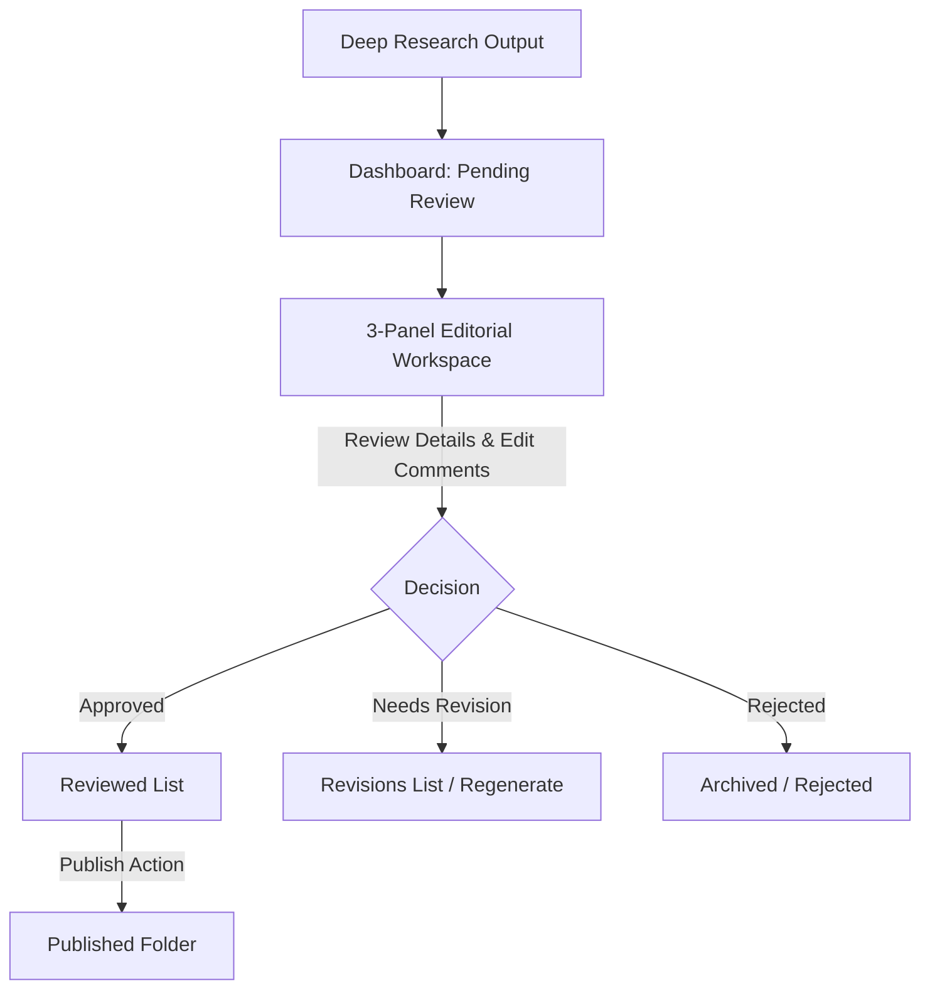

# 🌊 BlueOcean Report Review Dashboard

A modern, simple, and production-ready React 18 application built with **Vite**, **TypeScript**, and **TailwindCSS**. 

This dashboard serves as the **Human-in-the-Loop (HITL) Editor** for the Deep Research generation engine (`gen_rpt`). It allows editorial teams to review generated AI reports, evaluate AI scores, leave targeted comments, request section regenerations, and manage publication flow before publishing reports to the production folder.

---

## 🛠️ Technology Stack

- **Framework**: [React 18](https://react.dev/) + [Vite](https://vitejs.dev/) + [TypeScript](https://www.typescriptlang.org/)
- **Routing**: [React Router v6](https://reactrouter.com/) (declarative nested routes)
- **Styling**: [TailwindCSS](https://tailwindcss.com/) (integrated corporate style guide with custom-tailored enterprise theme colors)
- **Data Caching & Syncing**: [TanStack Query v5](https://tanstack.com/query/latest) (React Query)
- **State Management**: [Zustand](https://docs.pmnd.rs/zustand/getting-started/introduction) (separated lightweight global stores)
- **Icons**: [Lucide React](https://lucide.dev/)

---

## 📖 Developer Documentation

Comprehensive documentation guides are available in the **[docs/](file:///d:/BlueOcean/gen_rpt_review-frontend-main/docs/README.md)** directory:

*   **[Architecture & Data Flow](file:///d:/BlueOcean/gen_rpt_review-frontend-main/docs/architecture.md)**: Zustand global stores, React Query caching/mutations, and mock service layer.
*   **[Component Reference](file:///d:/BlueOcean/gen_rpt_review-frontend-main/docs/components.md)**: Details on the 3-panel review canvas, sidebar counts, and layouts.
*   **[Highlighting & Navigation](file:///d:/BlueOcean/gen_rpt_review-frontend-main/docs/highlighting_navigation.md)**: Regex parser for `review.md`, smooth scrolling, and inline DOM highlights.
*   **[Editorial Workflows](file:///d:/BlueOcean/gen_rpt_review-frontend-main/docs/workflows.md)**: Visual state transitions and action pathways for approval/revision/rejection.
*   **[Development & Customization](file:///d:/BlueOcean/gen_rpt_review-frontend-main/docs/development.md)**: Scripts, configuration maps, and how to customize reports in `mockData.ts`.

---

## 📂 Codebase Directory Structure

The frontend application follows a clean, modular React directory structure under `src/`:

```text
src/
├── assets/             # Static assets, logos, and global styles
├── components/         # Reusable components
│   ├── comments/       # Comment thread card list
│   ├── common/         # Generic UI (StatusBadge, EmptyState, SectionCard, Toast)
│   ├── dashboard/      # Stat cards & main aggregate reports table
│   ├── layout/         # Core navigation Shell (Sidebar, AppLayout)
│   ├── report/         # Report preview canvas & dynamic report card grids
│   └── review/         # AI score lists, human editorial panel, and header bars
├── hooks/              # Custom query & mutation hooks wrapping services
├── pages/              # Routed pages
│   ├── Dashboard/      # Main stats and aggregate reports table
│   ├── Review/         # Awaiting-review grid and the main 3-panel review canvas
│   ├── Reviewed/       # Human-approved list ready for publishing
│   ├── Published/      # Successfully published archives
│   ├── Revisions/      # Reports sent back for regeneration/revision
│   └── Settings/       # User profile details and auto-approve threshold sliders
├── routes/             # App Router mapping pages to layout slots
├── services/           # Async service layers simulating mock repository and database
├── store/              # Global state managers for UI, Auth, and active forms
├── types/              # Type-safe TypeScript domain interfaces & schemas
└── utils/              # Text formatters, styling helpers, and constants
```

---

## 🧭 Key Features & User Workflows



### 1. Unified Dashboard
- Displays metrics cards: Total Reports, Pending Human Review, AI Approved, Approved, and Needs Revision.
- Table view displaying each report's general metrics: overall AI score, grade (Gold/Silver/Bronze), status, last updated time, and quick actions.

### 2. The Interactive 3-Panel Editorial Workspace
Clicking any report in the review list opens the main editor interface:
- **Left Panel (Global Sidebar)**: Direct navigation links with real-time numeric badges displaying the counts of pending items.
- **Middle Panel (Document Preview)**: Renders the full report dynamically mimicking a sheet of paper. Includes **Text Zoom controls** (70% - 150%) for layout inspection.
- **Right Panel (Metrics, Editor, & Feedback)**:
  - **AI Evaluation**: Shows detailed scores (strategic insight, source/design quality, writing grade), highlighted strengths & weaknesses, executive audience readiness, and recognized gaps.
  - **Editorial Control Form**: Change the state (`Approved`, `Needs Revision`, `Rejected`). If `Needs Revision` is selected, the reviewer can select the target section, prioritize the feedback, specify instructions, and send it to the AI for regeneration.
  - **Annotation Threads**: Leave comments tied to specific sections with severity levels (`High`, `Medium`, `Low`) and resolve them upon completion.

---

## 🏛️ Application Architecture & State Flow

### 🔌 State Management (`src/store/`)
The application uses **Zustand** to decouple state from UI rendering:
1. **[authStore.ts](file:///d:/Intenship/gen_rpt-main/frontend/src/store/authStore.ts)**:
   - Persists reviewer profile information (Name, Role, and custom AI Auto-Approve thresholds) directly to `localStorage`.
2. **[uiStore.ts](file:///d:/Intenship/gen_rpt-main/frontend/src/store/uiStore.ts)**:
   - Handles sidebar collapsing state, global toast notifications (dismissible status alerts), and the dynamic Document Zoom percentage.
3. **[reviewStore.ts](file:///d:/Intenship/gen_rpt-main/frontend/src/store/reviewStore.ts)**:
   - Holds active draft values for the human review editor (selected target section, revision priority level, and instruction text).

> [!NOTE]
> Separating the active form state into `reviewStore.ts` prevents unnecessary parent component re-renders when a reviewer is typing feedback in the review panel.

### 🔄 Data Fetching & Caching (`src/hooks/`)
To make UI updates fast and keep local state synchronized with services, we use **React Query** hooks:
- **[useReports.ts](file:///d:/Intenship/gen_rpt-main/frontend/src/hooks/useReports.ts)**:
  - `useReports()`: Fetches all reports with `staleTime: 30s`.
  - `useReport(id)`: Fetches a single report by ID.
  - `useDashboardMetrics()`: Utility calculating live count numbers for the Dashboard.
- **[useReviewActions.ts](file:///d:/Intenship/gen_rpt-main/frontend/src/hooks/useReviewActions.ts)**:
  - Manages mutation methods like `saveReview`, `markDone`, `sendToPublish`, `requestRegeneration`, and comment threads.
  - Automatically invalidates query caches on success to trigger silent background page updates.

### 🌐 Data & Service Layer (`src/services/`)
- All services interact with simulated repository datasets (`reports.service.ts`, `comments.service.ts`, `reviews.service.ts`, `publish.service.ts`).
- **[mockData.ts](file:///d:/Intenship/gen_rpt-main/frontend/src/services/mockData.ts)** holds pre-populated data conforming to the raw JSON schemas generated by the Deep Research engine.

---

## 🚀 Getting Started & Local Development

### Prerequisites
- [Node.js](https://nodejs.org/) (version 18.0.0 or higher recommended)
- `npm` (bundled with Node.js)

### Setup Instructions

1. **Change directories to the frontend workspace**:
   ```bash
   cd frontend
   ```

2. **Install all dependencies**:
   ```bash
   npm install
   ```

3. **Start the local Vite development server**:
   ```bash
   npm run dev
   ```
   - The dashboard will be available at [http://localhost:5173](http://localhost:5173) by default.
   - Hot Module Replacement (HMR) is enabled, so changes in code will reflect immediately.

4. **Lint and Type Check**:
   To verify TypeScript compiler safety and run style checks:
   ```bash
   npm run lint
   ```

5. **Build for Production**:
   Compiles optimized static production-ready bundles inside the `dist/` directory:
   ```bash
   npm run build
   ```

---

## 🎨 Theme & Typography Customization
- **Global CSS**: Defined in **[index.css](file:///d:/Intenship/gen_rpt-main/frontend/src/index.css)**. Sets fonts to **Inter** (loaded via Google Fonts) and defines core styles like paper-style document previews and visual borders.
- **Colors & Utility styles**: Configured via **[tailwind.config.js](file:///d:/Intenship/gen_rpt-main/frontend/tailwind.config.js)**. You can change primary highlights or custom background scales here to fit branding themes.
