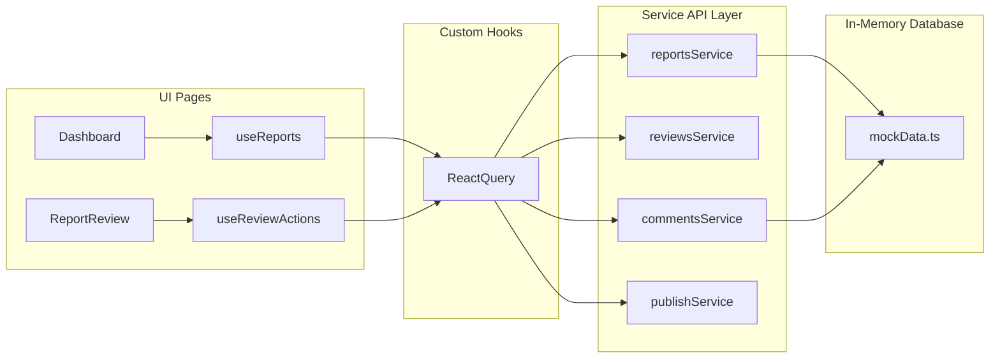

# 🏛️ Application Architecture & Data Flow

This document details the software architecture, state management patterns, and data-fetching techniques employed in the BlueOcean Report Review Dashboard.

---

## 🧭 System Overview & Routes

The application uses **React Router v7 (React Router DOM)** to handle page routing. The root structure is wrapped inside `AppLayout`, which provides a global sidebar container, global alerts/toasts, and routing slots.

The routes are declared in **[routes/index.tsx](file:///d:/BlueOcean/gen_rpt_review-frontend-main/src/routes/index.tsx)**:

| Path | Component | Description |
| :--- | :--- | :--- |
| `/` | `Navigate` | Redirects to `/dashboard`. |
| `/dashboard` | `Dashboard` | The central landing page displaying KPI cards and the aggregate report overview table. |
| `/ai-reviewed` | `AIReviewedList` | A grid of generated reports that have undergone automatic AI evaluation and are awaiting human audit. |
| `/review/:reportId` | `ReportReview` | The interactive 3-panel workspace for auditing, leaving comments, and writing revisions. |
| `/approved` | `ApprovedReportsList` | Grid of reports approved by editorial leads, ready to be sent to production. |
| `/revisions` | `RevisionsList` | Archive of reports returned to the AI generation pipeline for rewrite/regeneration. |
| `/rejected` | `RejectedList` | Archive of rejected/discarded reports. |
| `/published` | `PublishedList` | Archive of successfully published reports. |
| `/settings` | `Settings` | User configuration panel for reviewer names, roles, and AI score auto-approve thresholds. |

---

## ⚡ State Management (Zustand)

Global UI states, persisted profile configs, and active review forms are managed using **Zustand** stores in `src/store/`. This decouples side-effects and form state from React's render tree, protecting the editor canvas from re-render lag when the user types comments.

### 1. Auth & Settings Store (`src/store/authStore.ts`)
*   **Purpose**: Stores the active reviewer’s profile information (`reviewerName`, `reviewerRole`) and the `aiThreshold` value (which marks whether a report automatically gets classified as high quality).
*   **Feature**: Employs the `persist` middleware to save these settings to `localStorage` under the key `blueocean-auth`.
*   **Methods**:
    *   `setReviewerName(name)` / `setReviewerRole(role)` / `setAiThreshold(threshold)`
    *   `getAvatarInitials()`: Returns a two-character uppercase string based on the current name.

### 2. UI Store (`src/store/uiStore.ts`)
*   **Purpose**: Manages global layout states:
    *   `sidebarCollapsed`: Collapses the left sidebar.
    *   `zoomLevel`: Controls the document text size percentage (bounded between 70% and 150%).
    *   `toasts`: Holds a list of active Toast notifications.
    *   `searchQuery` / `statusFilter`: Input states for filtering tables and grids.
*   **Methods**:
    *   `zoomIn()` / `zoomOut()`: Increases/decreases the zoom by 10%.
    *   `showToast(message, type)`: Generates a toast notification with a unique ID and auto-clears it after 3 seconds.

### 3. Review Store (`src/store/reviewStore.ts`)
*   **Purpose**: Houses the transient form data for the Human Editorial Panel:
    *   `decision`: Selected radio action (`Approved`, `Needs Revision`, `Rejected`).
    *   `commentText`: The feedback/instructions draft textarea.
    *   `commentSection`: The dropdown section targeting the feedback (e.g. `Executive Summary`).
    *   `commentPriority`: The severity priority of the revision request (`Low`, `Medium`, `High`).
*   **Note**: Using Zustand here avoids triggering heavy document rendering passes as the user types their revision instructions.

### 4. Annotation Store (`src/store/annotationStore.ts`)
*   **Purpose**: Manages the interactive hover-and-click sidebar detail panel:
    *   `annotations`: Contains all parsed annotations extracted from the loaded `review.md`.
    *   `activeAnnotation`: The specific flaw/finding detail currently opened in the right annotation sidebar (or null if closed).
*   **Methods**: `openAnnotation(ann)` and `closeAnnotation()`.

### 5. Report Navigation Store (`src/store/reportNavigationStore.ts`)
*   **Purpose**: Handles navigation tab triggers and scroll highlighting inside the 3-panel editorial view:
    *   `activeTab`: Controls the current tab page of the report canvas (`report` or `ai-review`).
    *   `highlightedId`: Holds the DOM ID of a paragraph that should be scrolled into view and flashed with a blue indicator.
*   **Methods**: `navigateTo(paragraphId)` automatically switches the active tab to `report` and updates the target ID.

---

## 🔄 Async Data Fetching (TanStack Query)

To manage data cache consistency and background synchronization, the application wraps all service calls in React Query hooks in `src/hooks/`:

### 1. `useReports` Hook (`src/hooks/useReports.ts`)
Handles the reading of reports and computes stats for dashboard counters:
*   `useReports()`: Fetches the list of all reports (cached with a `staleTime` of 30 seconds).
*   `useReport(id)`: Fetches a single report object.
*   `useDashboardMetrics()`: Computes counts of reports grouped by status (`Approved`, `Needs Revision`, `AI Reviewed`, etc.) to feed dashboard counts.

### 2. `useReviewActions` Hook (`src/hooks/useReviewActions.ts`)
Handles mutation operations that change reports or add comments, ensuring that the caches are immediately invalidated on success so the UI stays up-to-date:
*   `submitComment`: Submits a section comment thread and invalidates `['comments']` and `['reports']`.
*   `resolveComment`: Marks an existing comment as resolved.
*   `saveReview`: Saves the active editorial decision state.
*   `markDone`: Approves a report.
*   `sendToPublish`: Approves a report and pushes it to the publishing queue.
*   `requestRegeneration`: Posts feedback, changes status to `Needs Revision`, and logs regeneration intent.
*   `rejectReport`: Rejects a report.

---

## 🌐 Mock Service Database Layer (`src/services/`)

The application runs purely in the client by simulating a database using an in-memory variable populated from **[services/mockData.ts](file:///d:/BlueOcean/gen_rpt_review-frontend-main/src/services/mockData.ts)**.

### Mock Services:
*   **[reports.service.ts](file:///d:/BlueOcean/gen_rpt_review-frontend-main/src/services/reports.service.ts)**: Deep-copies `MOCK_REPORTS` on load to ensure session edits are preserved. Simulates async latency using a small delay timer.
*   **[comments.service.ts](file:///d:/BlueOcean/gen_rpt_review-frontend-main/src/services/comments.service.ts)**: Appends comments and modifies comment status.
*   **[reviews.service.ts](file:///d:/BlueOcean/gen_rpt_review-frontend-main/src/services/reviews.service.ts)**: Orchestrates workflows (e.g. `requestRegeneration` will submit comments, set the report status to `Needs Revision`, and update the timestamp).
*   **[publish.service.ts](file:///d:/BlueOcean/gen_rpt_review-frontend-main/src/services/publish.service.ts)**: Appends reports to a local publish log and transitions their status.
