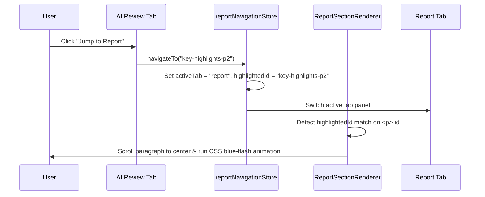

# 🔍 Inline Highlighting & Navigation Syncing

One of the key features of the BlueOcean Report Review Dashboard is the interactive syncing between AI review findings, human comments, and the report text. This document explains how findings are parsed, mapped to DOM paragraphs, highlighted inline, and scrolled into view.

---

## 📝 The Review Markdown Format (`review.md`)

The dashboard loads a markdown document (simulating an automated evaluation output from the AI backend) containing critique points. To associate comments with specific parts of the report, the audit uses special **Location** marker lines.

### Supported Formats
The parser supports three location line structures:

```markdown
# (A) Full format with single/double-quoted exact quote to highlight:
> Location → [Section Name] | Para 1 | 'China's private equity' -> 'cautious stance'

# (B) Start-to-end range format:
> Location -> [Section Name] | Para 2 | "The Chinese private" -> "more mature phase"

# (C) Target section & paragraph only (no quote highlights):
> Location -> [Section Name] | Para 4
```

> [!TIP]
> Both the unicode arrow `→` and the ASCII arrow `->` are fully supported by the regex compiler.

---

## 🛠️ Parsing Annotations (`reviewHighlighter.ts`)

The parser function **`parseReviewAnnotations(reviewMdText)`** scans the markdown file line-by-line using a regex pattern:

```typescript
const LOCATION_LINE_RE = new RegExp(
  String.raw`(?:^|\n)\s*>?\s*Location\s*` +
    ARROW +
    String.raw`\s*\[([^\]]+)\]` +           // [1] Section Name
    String.raw`(?:\s*\|\s*Para\s*([\d-]+))?` + // [2] Paragraph Index (e.g. 2 or 1-4)
    String.raw`(?:\s*\|` +
    String.raw`\s*(?:['"])((?:[^'"\\]|\\.)*)(?:['"])` + // [3] Exact Quote
    String.raw`\s*` + ARROW + String.raw`\s*` +
    String.raw`(?:['"])((?:[^'"\\]|\\.)*)(?:['"])` +    // [4] Ending quote or context
    String.raw`)?`,
  'gi'
);
```

### Explanation Resolution
To make hover-cards helpful, the parser must find the "finding description" corresponding to each location marker.
It walks backward from the location line to find the nearest preceding non-empty line in the same block, skipping system keys (like `- Missing:`, `- Fix:`, `- Example:`) and section headers (`##`). This resolved string becomes the `explanation`.

---

## 🎨 Direct DOM Highlighting Injection

To bypass React Virtual DOM reconciliation overhead and avoid breaking React's hydration models when highlights update:

1.  **DOM Node Walk**: The function **`applyHighlightsToDOM`** walks the raw DOM tree of the report preview recursively, searching for text nodes that contain the exact quote of an annotation.
2.  **Unwrapping Existing Spans**: On run, it first unwraps any existing highlighters by replacing `<span>` tags with bare text nodes, keeping the highlighter idempotent.
3.  **Span Wrapper Injection**: When a match is found in a text node, it splits the node into three: `[Text Node (Before)]`, `[HTMLSpanElement (Match)]`, and `[Text Node (After)]`.
4.  **Event Binding**: The injected `<span>` is styled with custom Tailwind-like hover states, a dashed red underline, and is bound to a click event listener that calls `openAnnotation(ann)` in the Zustand store.

This logic is executed safely inside a React `useEffect` inside the custom **`useReviewHighlighter`** hook, which is instantiated in `ReportPreview.tsx`.

---

## 🧭 Location Indexing & Navigation Scrolls

To support jumping directly from an AI finding on the "AI Review" tab to the exact paragraph on the "Report" tab, the application builds a coordinates map.



### 1. Document Paragraph IDs
When the report body is rendered by **`ReportSectionRenderer`**, it splits the section body by double newlines (`\n\n`) to identify paragraphs.
*   Structural list nodes (lines starting with `-` or `1.`) are rendered as `<ul>`/`<ol>` elements and are skipped from paragraph counting.
*   Prose paragraphs are assigned a stable DOM ID using the schema:
    ```typescript
    export function paragraphId(sectionHeading: string, paraIndex: number): string {
      return `${slugify(sectionHeading)}-p${paraIndex}`; // e.g. "key-highlights-p1"
    }
    ```

### 2. Location Indexing (`locationIndex.ts`)
The function **`buildLocationIndex(sections)`** builds a fast-lookup catalog of the document:
*   It generates a list of section headings and slugs.
*   It assigns DOM IDs to every prose paragraph.
*   It generates a `byId` record for fast DOM ID to metadata mapping, which stores a 80-character text preview snippet.

### 3. Resolution & Smooth Scroll
When the user clicks **Jump to Report** in a finding card:
1.  **`resolveLocation(section, paragraph, index)`** matches the section name/slug and returns the corresponding paragraph DOM ID.
2.  The application updates `highlightedId` in the navigation store.
3.  A `useEffect` hook inside the targeted paragraph element triggers a smooth scroll (`scrollIntoView({ behavior: 'smooth', block: 'center' })`).
4.  A CSS keyframe animation `.para-highlighted` flashes the paragraph background and border with a blue color before returning to transparent.
