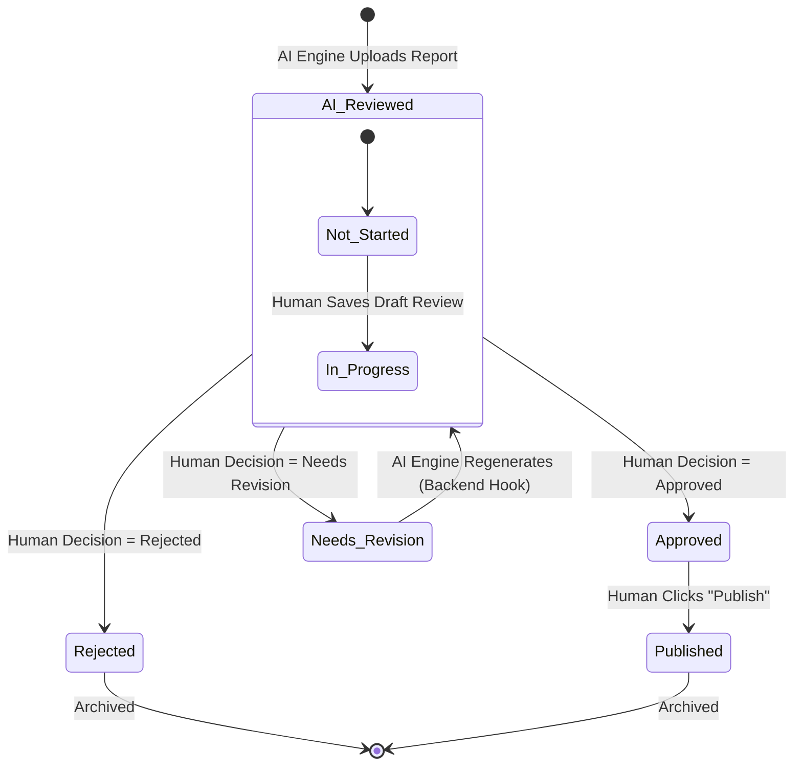
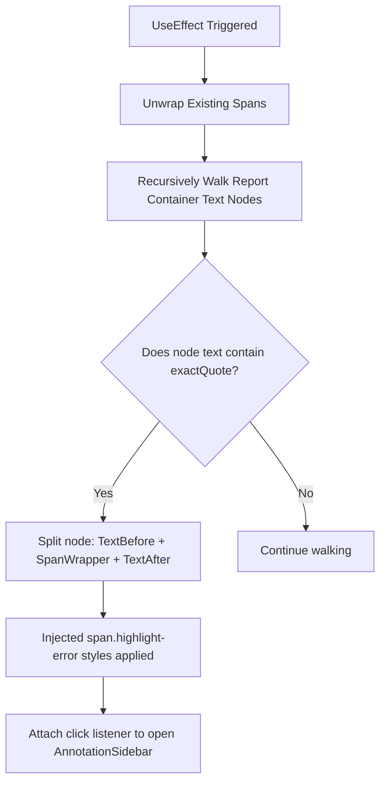

# 🌊 BlueOcean Report Review Dashboard — Complete Reference Guide

This document serves as the master specification and code guide for the **BlueOcean Report Review Dashboard** (Vite + React + TS). It details the overall architecture, backend Cloudflare Pages Functions, state management systems, the custom coordinates-based inline highlighting engine, and profiles **every component** in the codebase.

---

## 📌 Table of Contents

1. [Project Overview & Architecture](#-1-project-overview--architecture)
2. [Review Status Lifecycle & Editorial Workflows](#-2-review-status-lifecycle--editorial-workflows)
3. [Coordinates Highlighting & Navigation Syncing](#-3-coordinates-highlighting--navigation-syncing)
4. [Global State Management (Zustand)](#-4-global-state-management-zustand)
5. [Backend Cloudflare Pages Functions (API)](#-5-backend-cloudflare-pages-functions-api)
6. [UI Component Directory (All Components Profiled)](#-6-ui-component-directory-all-components-profiled)
7. [Developer Guide & Extension Patterns](#-7-developer-guide--extension-patterns)

---

## 🏛️ 1. Project Overview & Architecture

The Report Review Dashboard acts as the **Human-in-the-Loop (HITL) Editorial Canvas** for the GateX/BlueOcean AI Deep Research Report Generation Engine. It allows human editors to audit automatically compiled intelligence reports, inspect AI evaluation metrics, highlight text-level flaws, add revision feedback targeting specific document paragraphs, and publish finalized documents to production.

```text
                               ┌────────────────────────────────────────────────────────┐
                               │                    CLIENT BROWSER                      │
                               │                                                        │
                               │  ┌─────────────────────────┐     ┌──────────────────┐  │
                               │  │       React Pages       │◄───►│  Zustand Stores  │  │
                               │  └────────────┬────────────┘     └──────────────────┘  │
                               │               │ (TanStack Query)                       │
                               └───────────────┼────────────────────────────────────────┘
                                               │ HTTP /api/*
                               ┌───────────────▼────────────────────────────────────────┐
                               │             CLOUDFLARE PAGES FUNCTIONS                 │
                               │                                                        │
                               │         CORS Middleware & Serverless API Routes        │
                               │         (Node/Worker Runtime, aws4fetch S3 API)        │
                               └───────────────┬────────────────────────────────────────┘
                                               │ S3 Protocol
                               ┌───────────────▼────────────────────────────────────────┐
                               │                    CLOUDFLARE R2                       │
                               │                                                        │
                               │   • catalog/catalog.json     • reports/[id]/manifest   │
                               │   • reports/[id]/comments    • reports/[id]/report.md  │
                               └────────────────────────────────────────────────────────┘
```

### Technical Stack
*   **Vite 8 & React 19 (TypeScript 6)**: Builds the application bundle. Vite supports fast hot-module-replacement (HMR), and TypeScript enforces compile-time safety.
*   **Zustand v5**: Handles UI state, persisted user profiles, and active review forms. Storing form drafts in Zustand prevents laggy re-renders in the interactive document preview as the user types.
*   **TanStack React Query v5**: Powers data fetching, asynchronous state tracking, caching, and cache invalidation.
*   **Tailwind CSS**: A clean, customized color utility palette using custom variables configured in `tailwind.config.js` (`bg-surface-body`, `bg-surface-panel`, etc.).
*   **Cloudflare Pages Functions**: Serverless runtime API endpoints acting as the data gateway.
*   **S3-Compatible Client (`aws4fetch`)**: Cloudflare Pages Functions connect to an external R2 bucket using `aws4fetch` (a lightweight AWS v4 signature signing client) instead of the heavy AWS SDK or native CF bindings. This is necessary because the target R2 bucket resides in a different Cloudflare account.

---

## 🚦 2. Review Status Lifecycle & Editorial Workflows

A report transitions through several distinct statuses representing the AI engine, human editorial review, and final production states.

### 1. Status Fields
Each report object contains two state fields:
*   `status`: The global system state (`Generated`, `AI Reviewed`, `Needs Revision`, `Approved`, `Published`, `Rejected`).
*   `humanStatus`: The human reviewer action state (`Not Started`, `Pending`, `In Progress`, `Approved`, `Needs Revision`, `Rejected`).

### 2. State Diagram


### 3. Workflow Stages
1.  **AI Generation & Grading (Ingress)**: The backend AI pipeline compiles the report, runs automated critique files (`review.md` and `review.json`), and uploads the assets into Cloudflare R2, setting `status = 'AI Reviewed'` and `humanStatus = 'Not Started'`.
2.  **Assessment (HITL Workspace)**: A reviewer opens the dashboard, chooses an `AI Reviewed` report, reads the document text, inspects automated findings, and interacts with inline highlighted flaws.
3.  **Needs Revision (AI Cycle)**: The reviewer selects `Needs Revision`, chooses a document section and a priority level, writes explicit instructions, and clicks **Save Review**. The report status changes to `Needs Revision`, moving it to the Revision Queue. This status triggers the backend AI engine to ingest the comments, execute targeted web searches, and regenerate the specified sections.
4.  **Approval & Publication**: Once the report meets the required quality thresholds, the editor sets the decision to `Approved`. This changes the status to `Approved`. The editor then clicks **Publish Report**, which updates `status = 'Published'`, sets `publishReady = true`, creates a `PublishRecord` logging the metadata, and archives the document.
5.  **Rejection**: Redundant, incorrect, or out-of-scope reports can be permanently rejected after confirming a modal popup. This flags both status fields as `Rejected`.

---

## 🔍 3. Coordinates Highlighting & Navigation Syncing

To connect AI review findings directly with the report text, the dashboard uses a coordinates-based mapping system.

### 1. The Parsing Phase (`locationParser.ts` & `reviewHighlighter.ts`)
The dashboard fetches a raw critique file (`review.md` or `review.json`) generated by the AI backend. It scans the lines using a custom regular expression that extracts location metadata:

```typescript
const LOCATION_LINE_RE = new RegExp(
  String.raw`(?:^|\n)\s*>?\s*Location\s*` +
    ARROW +
    String.raw`\s*\[([^\]]+)\]` +           // Section Name (e.g. "Key Highlights")
    String.raw`(?:\s*\|\s*Para\s*([\d-]+))?` + // Paragraph index (e.g. "1")
    String.raw`(?:\s*\|` +
    String.raw`\s*(?:['"])((?:[^'"\\]|\\.)*)(?:['"])` + // Start quote text to match
    String.raw`\s*` + ARROW + String.raw`\s*` +
    String.raw`(?:['"])((?:[^'"\\]|\\.)*)(?:['"])` +    // End quote context
    String.raw`)?`,
  'gi'
);
```

#### Explanation Resolution
For each location match, the parser walks backward through the markdown file lines to identify the nearest preceding bullet text. It ignores formatting markers and system tags (such as `- Fix:` or `- Expected Impact:`), resolving this string as the `explanation` displayed in the sidebar.

#### Section Inference Fallback
If the critique file has a plain text finding that is not formatted with a strict location string, `inferSectionFromText` searches for any substring matches against a list of known section headings (sorted longest first to ensure precise matching), returning a best-effort location.

---

### 2. Direct DOM Highlighting (`useReviewHighlighter.ts`)
To avoid virtual DOM overhead and prevent hydration mismatch warnings, highlights are applied using raw DOM manipulation inside a React `useEffect` hook:



1.  **Cleanup**: All existing elements matching `span.highlight-error` are first unwrapped, replacing the span elements with bare text nodes to ensure idempotency.
2.  **DOM Walker**: The walk recursively searches for text nodes within the report body. When a text node containing the `exactQuote` is found, it is split, wrapping the target substring in a `span` with a dashed red underline and hover backgrounds.
3.  **Event Binding**: Click events on these injected spans are captured, calling `openAnnotation(ann)` in the Zustand store.

---

### 3. Scroll Sync & Visual Flash (`locationIndex.ts`)
Prose paragraphs are mapped to stable DOM IDs during rendering using the schema: `${slugify(sectionHeading)}-p${paragraphIndex}` (e.g., `key-highlights-p2`).

1.  **Location Index Building**: `buildLocationIndex(sections)` maps every prose block (skipping tables and bulleted lists) to its DOM ID and caches a text preview snippet.
2.  **Navigation Trigger**: When clicking **Jump to Report** next to an AI finding card, `resolveLocation()` finds the matching paragraph ID and calls `navigateTo(paragraphId)` in the store.
3.  **Coordinate Jump**: The target paragraph's internal `useEffect` triggers a smooth scroll (`scrollIntoView({ behavior: 'smooth', block: 'center' })`).
4.  **CSS Flash**: A keyframe animation flashes the paragraph background and left border with a bold blue color (`.para-highlighted`) for 2.5 seconds to draw the editor's attention.

---

## ⚡ 4. Global State Management (Zustand)

Global UI states, reviewer profiles, and editorial form drafts are decoupled from React state to optimize performance.

### 1. Auth & Settings Store (`src/store/authStore.ts`)
*   **State Variables**:
    *   `reviewerName`: The active editor's name (defaults to "Yash Yelave").
    *   `reviewerRole`: The active editor's role (defaults to "Editorial Lead").
    *   `aiThreshold`: The quality score threshold (defaults to 85) above which reports are automatically highlighted as high quality.
*   **Actions**: `setReviewerName`, `setReviewerRole`, `setAiThreshold`.
*   **Helper**: `getAvatarInitials()` returns a two-letter uppercase string derived from the name.
*   **Persistence**: Configured with `persist` middleware, saving settings to `localStorage` under `blueocean-auth`.

### 2. UI Store (`src/store/uiStore.ts`)
*   **State Variables**:
    *   `sidebarCollapsed`: Boolean toggling sidebar width.
    *   `zoomLevel`: Text zoom percentage for the document reader (bounded between 70% and 150%).
    *   `toasts`: List of active toast notification structures (`id`, `message`, `type`).
    *   `searchQuery`: Main dashboard search filter.
    *   `statusFilter`: Active tab selection for report filters.
*   **Actions**: `toggleSidebar`, `zoomIn`, `zoomOut`, `showToast`, `dismissToast`.

### 3. Review Store (`src/store/reviewStore.ts`)
*   **State Variables**:
    *   `decision`: Selected editorial radio option (`'Approved'`, `'Needs Revision'`, `'Rejected'`, or `''`).
    *   `commentText`: Draft textarea instructions for a revision request.
    *   `commentSection`: Selected target report section for the revision.
    *   `commentPriority`: Selected priority level (`'High'`, `'Medium'`, `'Low'`).
*   **Actions**: `setDecision`, `setCommentText`, `setCommentSection`, `setCommentPriority`, `reset()`.
*   **Purpose**: Typing review feedback does not trigger heavy document rendering passes.

### 4. Annotation Store (`src/store/annotationStore.ts`)
*   **State Variables**:
    *   `annotations`: Array of parsed `ReviewAnnotation` objects extracted from the active report's markdown review.
    *   `activeAnnotation`: The specific flaw detail currently open in the floating sidebar (or `null` if closed).
*   **Actions**: `setAnnotations`, `openAnnotation`, `closeAnnotation`.

### 5. Report Navigation Store (`src/store/reportNavigationStore.ts`)
*   **State Variables**:
    *   `activeTab`: Active panel view (`'report'` or `'ai-review'`).
    *   `highlightedId`: DOM ID of the paragraph targeted for scroll navigation.
*   **Actions**: `setActiveTab`, `clearHighlight`, `navigateTo(paragraphId)` (which automatically sets `activeTab = 'report'` and updates `highlightedId`).

---

## 🌐 5. Backend Cloudflare Pages Functions (API)

All database operations are mediated by backend API routes under `/functions/api/`. These handle storage tasks against a Cloudflare R2 bucket.

### 📁 Directory Layout
```text
functions/
├── _middleware.ts
├── _shared/
│   └── r2.ts
└── api/
    └── reports/
        ├── [id]/
        │   ├── comments.ts
        │   ├── report.ts
        │   ├── review.ts
        │   └── status.ts
        ├── [id].ts
        └── index.ts
```

### 1. Global CORS Middleware (`functions/_middleware.ts`)
Intercepts all incoming `/api/*` endpoints to handle OPTIONS preflight requests and inject global CORS access headers, allowing cross-origin requests.

### 2. S3-Compatible Client API (`functions/_shared/r2.ts`)
Cloudflare Pages native bindings cannot be used directly because the R2 bucket belongs to a separate Cloudflare account. Instead, the backend constructs an S3 client using `aws4fetch`.
*   **`S3Bucket`**: Implements basic S3 client operations (`get`, `put`).
*   **`getCatalog(bucket)`**: Fetches `catalog/catalog.json`, which acts as the index list of all reports.
*   **`updateCatalogEntry(bucket, id, updates)`**: Finds a catalog entry by ID and merges updates back into the index.
*   **`getManifest(bucket, id)`** & **`putManifest(bucket, id, manifest)`**: Manages the detailed manifest file containing metadata for a specific report.
*   **`getComments(bucket, id)`** & **`putComments(bucket, id, comments)`**: Fetches or overwrites the comment thread file (`reports/${id}/comments.json`).

### 3. API Route Implementations
*   **`GET /api/reports`** ([index.ts](file:///d:/BlueOcean/gen_rpt_review-frontend-main/functions/api/reports/index.ts))
    *   Fetches the global catalog file from R2.
    *   Maps raw catalog items to the frontend's summary `Report` format to render tables and status counts.
*   **`GET /api/reports/:id`** ([\[id\].ts](file:///d:/BlueOcean/gen_rpt_review-frontend-main/functions/api/reports/[id].ts))
    *   Fetches the report's manifest, markdown body, AI evaluation JSON, and comment threads in parallel.
    *   Parses the raw report markdown into structured HTML-safe sections.
    *   Normalizes AI scores, component scores, strategic/data/gcc gaps, writing flaws, priority improvements, and executive readiness fields before returning the merged object.
*   **`POST /api/reports/:id/status`** ([status.ts](file:///d:/BlueOcean/gen_rpt_review-frontend-main/functions/api/reports/[id]/status.ts))
    *   Updates the manifest fields (`status`, `humanStatus`, `publishReady`) for a specific report.
    *   Syncs these status fields in the global `catalog.json` file.
    *   Returns the updated report object, including its comments.
*   **`GET /api/reports/:id/comments`** & **`POST /api/reports/:id/comments`** ([comments.ts](file:///d:/BlueOcean/gen_rpt_review-frontend-main/functions/api/reports/[id]/comments.ts))
    *   `GET`: Returns the active comments thread.
    *   `POST (Add Comment)`: Appends a new comment to the thread, updates `commentCount` in the manifest and catalog index, and returns the updated comment array.
    *   `POST (Resolve Comment)`: Targets a specific comment by ID, updates its status to `"resolved"`, updates the files, and returns the comments list.
*   **`GET /api/reports/:id/report`** ([report.ts](file:///d:/BlueOcean/gen_rpt_review-frontend-main/functions/api/reports/[id]/report.ts))
    *   Streams the raw markdown file (`report.md`) from R2.
*   **`GET /api/reports/:id/review`** ([review.ts](file:///d:/BlueOcean/gen_rpt_review-frontend-main/functions/api/reports/[id]/review.ts))
    *   Streams the raw review markdown/text output (`review.json`) from R2. Falls back to an empty string if not found.

---

## 🧱 6. UI Component Directory

The dashboard is built from 18 distinct modular UI components.

### 📂 Layout Components
#### 1. AppLayout (`src/components/layout/AppLayout.tsx`)
*   **Purpose**: The main shell container for the application.
*   **Features**:
    *   Integrates the left sidebar.
    *   Provides a toggleable mobile layout drawer overlay for smaller screens.
    *   Hosts the global `<ToastContainer />` wrapper.
    *   Renders router child components via `<Outlet />`.

#### 2. Sidebar (`src/components/layout/Sidebar.tsx`)
*   **Purpose**: The left-hand navigation panel.
*   **Features**:
    *   Provides links to all dashboard lists.
    *   Fetches real-time status counts via `useDashboardMetrics()` to show indicator badges next to menu routes (e.g., number of pending reviews).
    *   Displays active reviewer profile initials and roles from the auth store.

---

### 📂 Dashboard Components
#### 3. ReportTable (`src/components/dashboard/ReportTable.tsx`)
*   **Purpose**: Displays active reports awaiting human review.
*   **Features**:
    *   Provides interactive search queries filtering by report title or ID.
    *   Columns: Title/ID, AI Grade, Human Status badge, Comment Tally, and Last Updated.
    *   Clicking a row navigates to the review workspace for that report.

#### 4. StatCard (`src/components/dashboard/StatCard.tsx`)
*   **Purpose**: KPI cards at the top of the main dashboard.
*   **Features**:
    *   Displays titles, total counts, and color-coded indicator dots.
    *   Renders a secondary trend metric description.

---

### 📂 Report Rendering Canvas
#### 5. ReportPreview (`src/components/report/ReportPreview.tsx`)
*   **Purpose**: The primary 3-panel center workspace.
*   **Features**:
    *   **Tab switching**:
        *   **Report**: Renders the document header, contributor initials badges, section anchor buttons, and zoom controls.
        *   **AI Review**: Displays overall AI grade scores, strengths, weaknesses, data/strategic/gcc gaps, priority improvements, and executive readiness checkmarks.
    *   Integrates `useReviewHighlighter` to walk the DOM and render inline annotations.
    *   Includes the floating `AnnotationSidebar` panel.

#### 6. ReportRenderer (`src/components/report/ReportRenderer.tsx`)
*   **Purpose**: Formats a report section's body text as React elements.
*   **Features**:
    *   Splits markdown body strings into paragraphs.
    *   Maps paragraphs into structural elements, skipping lists and tables.
    *   Assigns unique HTML paragraph IDs (e.g., `key-highlights-p1`) for targeted scroll jumps.
    *   Watches `highlightedId` to trigger smooth scrolls and flash animations.

#### 7. ReportCard (`src/components/report/ReportCard.tsx`)
*   **Purpose**: Grid card representing a single report in status lists.
*   **Features**:
    *   Displays report titles, versions, and update times.
    *   Renders badges for status, AI scores, and comment counts.

#### 8. ReportGrid (`src/components/report/ReportGrid.tsx`)
*   **Purpose**: Wrapper layout rendering arrays of `ReportCard` components.
*   **Features**:
    *   Filters reports by status arrays using the `useFilteredReports` hook.
    *   Renders empty states if no reports match.

#### 9. AnnotationSidebar (`src/components/report/AnnotationSidebar.tsx`)
*   **Purpose**: A detailed drawer that slides out from the bottom-right corner when clicking an inline highlighted finding.
*   **Features**:
    *   Shows the flagged quote block and corresponding issue description.
    *   Renders location metadata badges (section and paragraph).
    *   Supports dismissal via clicking outside, close buttons, or pressing the Escape key.

---

### 📂 Audit & Feedback Actions
#### 10. ReviewTopbar (`src/components/review/ReviewTopbar.tsx`)
*   **Purpose**: Controls top header actions on the active review page.
*   **Features**:
    *   Displays current status badges, document IDs, and title strings.
    *   Provides quick back-navigation buttons.
    *   Includes queue controls (**Previous** / **Next**) to browse reports without returning to the main list.

#### 11. HumanReviewCard (`src/components/review/HumanReviewCard.tsx`)
*   **Purpose**: The active editorial panel in the right sidebar.
*   **Features**:
    *   **Decision Selector**: Radio buttons choosing between `Approved`, `Needs Revision`, or `Rejected`.
    *   **Approved Flow**: Renders approval messages and unlocks the primary **Publish Report** action.
    *   **Needs Revision Flow**: Displays section dropdown selection menus, priority ratings, instruction inputs, and **Save Review** triggers.
    *   **Rejected Flow**: Prompts the user with a confirmation modal before rejecting a report.

#### 12. AIReviewCard (`src/components/review/AIReviewCard.tsx`)
*   **Purpose**: Auxiliary component that packages AI evaluation metrics into a card layout.
*   **Features**:
    *   Displays overall scores, components, strengths, weaknesses, improvements, and executive readiness.

#### 13. CommentThread (`src/components/comments/CommentThread.tsx`)
*   **Purpose**: Lists active review comments in the right panel.
*   **Features**:
    *   Filters and groups comments left during the review cycle.
    *   Sorts comments by priority and section index.

#### 14. CommentCard (`src/components/comments/CommentCard.tsx`)
*   **Purpose**: Individual card representing a reviewer comment.
*   **Features**:
    *   Displays reviewer names, timestamps, target sections, priorities, and description texts.
    *   Renders status indicator borders (Blue for open, Orange for sent to regeneration, Green/faded for resolved).
    *   Includes a **Mark Resolved** button to resolve active comments.

---

### 📂 Common Widgets
#### 15. EmptyState (`src/components/common/EmptyState.tsx`)
*   **Purpose**: Placeholder component for empty lists.
*   **Features**:
    *   Supports custom icons, title text, and descriptions.

#### 16. SectionCard (`src/components/common/SectionCard.tsx`)
*   **Purpose**: Styled panel container used throughout the review workspace.
*   **Features**:
    *   Collapsible content sections.
    *   Renders optional headers, icons, and right-aligned buttons.

#### 17. StatusBadge (`src/components/common/StatusBadge.tsx`)
*   **Purpose**: Displays status strings inside a styled container.
*   **Features**:
    *   Applies color schemes matching the system status (`Generated`, `AI Reviewed`, etc.).

#### 18. Toast (`src/components/common/Toast.tsx`)
*   **Purpose**: Pop-up alerts indicating operation status.
*   **Features**:
    *   `<Toast />`: Renders message overlays with auto-clearing progress bars.
    *   `<ToastContainer />`: Fixed container stacked in the bottom-right corner to manage active toasts.

---

## 💾 7. Developer Guide & Extension Patterns

### 🚀 Local Development Setup
1.  **Dependencies**: Install the required packages:
    ```bash
    npm install
    ```
2.  **Environment Variables**: Create a `.dev.vars` file in the root directory for Cloudflare Wrangler local execution, or configure environment variables in your deployment dashboard:
    ```ini
    R2_ACCOUNT_ID=your_account_id
    R2_ACCESS_KEY_ID=your_access_key
    R2_SECRET_ACCESS_KEY=your_secret_key
    R2_BUCKET=your_bucket_name
    ```
3.  **Local Dev Server**: Launch Vite with backend Cloudflare Pages Function routing:
    ```bash
    npx wrangler pages dev
    ```
    Alternatively, launch Vite directly for frontend-only changes (mock services will fetch local fallbacks):
    ```bash
    npm run dev
    ```

---

### 💾 Data Schemas

#### 1. Manifest Schema (`manifest.json`)
Every report directory in R2 contains a `manifest.json` file structured as follows:
```json
{
  "report_id": "rep_pe_china_2026",
  "title": "Private Equity Landscape in China",
  "latest_version": "v1",
  "current_status": "ai_reviewed",
  "review_status": "pending",
  "ai_score": 82.5,
  "created_at": "2026-06-30T10:15:30Z",
  "updated_at": "2026-06-30T10:20:00Z",
  "files": {
    "report_md": "reports/rep_pe_china_2026/current/report.md",
    "review_json": "reports/rep_pe_china_Pe_2026/reviews/review.json"
  }
}
```

#### 2. Comment Schema (`comments.json`)
The comments list is stored as a JSON array of comment objects:
```json
[
  {
    "id": "cPe98u2a",
    "reportId": "rep_pe_china_2026",
    "version": "v1",
    "section": "Key Highlights",
    "text": "Please elaborate on regulatory impacts.",
    "priority": "High",
    "reviewer": "Yash Yelave",
    "timestamp": "2026-06-30T12:00:00Z",
    "status": "sent to regeneration"
  }
]
```

---

### 🛠️ Extending the Project

#### 1. Adding a New Route
1.  Create your page folder under `src/pages/NewFeature/index.tsx`.
2.  Open `src/routes/index.tsx` and import the page.
3.  Add the path config into `router` children:
    ```typescript
    { path: 'new-feature', element: <NewFeature /> }
    ```
4.  Add nav options inside the navigation list in `src/components/layout/Sidebar.tsx`.

#### 2. Adding a New Review Status
1.  Add the status code string to the `ReportStatus` Enum in `src/types/report.types.ts`.
2.  Define display badge colors in `src/utils/statusHelpers.ts` inside `statusBadgeClasses` and `humanStatusBadgeClasses`.
3.  Add text labels and status counts inside `getBadgeCount` in the `Sidebar` navigation logic if badges are required.
4.  Update the state mapping functions in `/functions/api/reports/[id].ts` and `index.ts` to support database translation.
