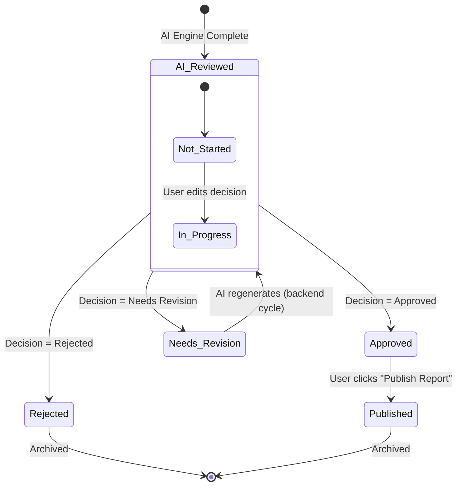

# 🔄 Editorial Audit Workflows & Report Lifecycle

This document explains the step-by-step report audit lifecycle, detailing status transitions, database updates, and UI actions.

---

## 🚦 Report Status States

A report transitions through several states in its lifecycle, represented by two main status fields:
*   `status`: The system-wide status (e.g. `AI Reviewed`, `Published`).
*   `humanStatus`: The human editorial status (e.g. `Not Started`, `Approved`, `Needs Revision`).

---

## 📥 Stage 1: AI Evaluation & Pending Review

1.  **Ingress**: The Deep Research engine (`gen_rpt`) generates a report along with an automated `review.md` audit file.
2.  **Initial Status**: The report enters the dashboard with:
    *   `status`: `"AI Reviewed"`
    *   `humanStatus`: `"Not Started"`
3.  **Discovery**: Reviewers find these reports under the **AI Reviewed** sidebar tab, which acts as the incoming queue.

---

## 🔍 Stage 2: Assessment & Collaborative Audit

1.  **Report View**: The reviewer clicks **Review** to open the workspace.
2.  **Highlight Walk**: The reviewer examines red dashed underlines in the document. Hovering reveals comments, and clicking opens the **Annotation Drawer** showing the gap description.
3.  **Cross-reference**: The reviewer uses **Jump to Report** links in the AI Review tab to cross-reference weaknesses with the text.
4.  **Leaving Feedback**: The reviewer select `Needs Revision` in the right panel and types section-specific feedback, clicking **Add Revision Comment** to append the comment to the live thread.

---

## 🟢 Stage 3: Approval & Publication Queue

When the report meets institutional quality standards:

1.  **Selection**: The reviewer selects **Approved** in the decision selector.
2.  **Status Shift**: Clicking **Save Review** updates `humanStatus` to `"Approved"`.
3.  **Action**: The reviewer clicks **Publish Report**.
4.  **Service Action** (`publishService.publish`):
    *   Changes the report `status` to `"Published"`.
    *   Marks `publishReady` as `true`.
    *   Creates a `PublishRecord` capturing the timestamp, publishing editor, and report version.
5.  **Archive**: The report moves out of the active queues into the **Published** tab.

---

## 🟠 Stage 4: Needs Revision & AI Regeneration

If a report has severe data gaps or strategic issues:

1.  **Selection**: The reviewer selects **Needs Revision** in the decision selector.
2.  **Add Instructions**: The reviewer selects a target section, chooses a priority (`High`, `Medium`, `Low`), types detailed instructions, and clicks **Add Revision Comment**.
    *   A comment is created in the database with the status `"sent to regeneration"`.
3.  **Submit**: Clicking **Save Review** calls `reviewsService.saveReview` (or `reviewsService.requestRegeneration`):
    *   Changes both `status` and `humanStatus` to `"Needs Revision"`.
    *   Logs the date and time.
4.  **Processing**: The report is moved to the **Revisions** tab. In production, this status triggers the backend AI engine to ingest the reviewer comments, perform new web searches, and overwrite the targeted report sections.

---

## 🔴 Stage 5: Report Rejection

If a report is out-of-scope, redundant, or fails criteria entirely:

1.  **Selection**: The reviewer selects **Rejected**.
2.  **Confirmation**: A modal overlay pops up to verify: *"Are you sure you want to reject [Report Title]?"*
3.  **Submit**:
    *   Clicking **Reject Report** sets both `status` and `humanStatus` to `"Rejected"`.
    *   The report is archived in the **Rejected** tab.
    *   Clicking **Cancel** resets the selection, allowing the reviewer to re-evaluate.
